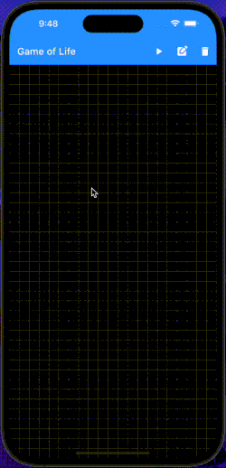

# Game of Life

A flutter implementation of [Conway's Game of Life](https://en.wikipedia.org/wiki/Conway%27s_Game_of_Life).

This was created to practice [Test Driven Development](http://www.butunclebob.com/ArticleS.UncleBob.TheThreeRulesOfTdd) by implementing the game engine at [./lib/domain/game_engine.dart](./lib/domain/game_engine.dart).
If you would like to try out some TDD with this project, check out the [Baseline Release](https://github.com/da1nerd/game_of_life/releases/tag/baseline) which contains all of the UI but leaves the game engine unimplemented.

## Usage
The UI comes with some pre-built controls to help you play the game:

* play/pause the generation timelapse.
* add/erase cells.
* delete the game.

Cells can be manually changed by clicking/tapping on an area in the grid. You can edit cells while the game is running or paused.

